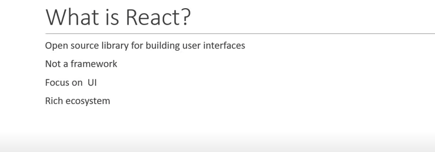
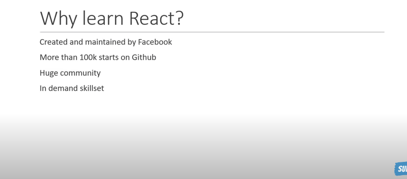
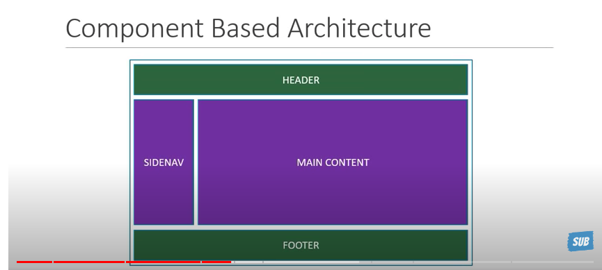
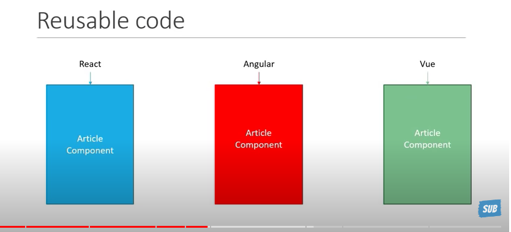
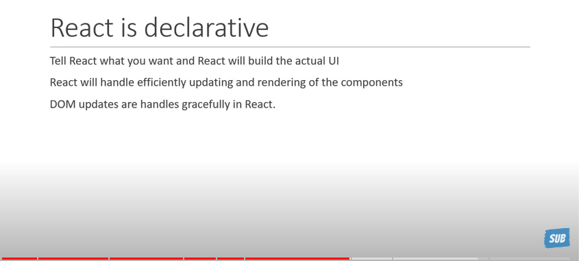
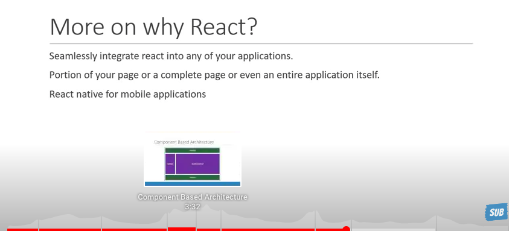
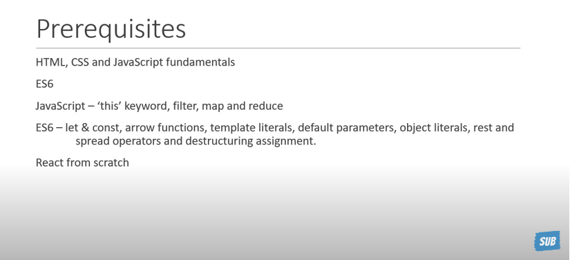
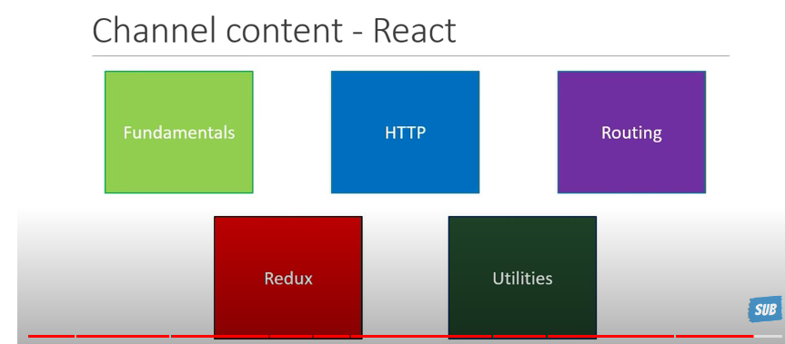

* React is an open source javascript library for building user interfaces.

* React is a project created and maintained by Facebook.
* React has more than a 100 thousand stars on GitHub and a huge community behind it.
* React has become increasingly 
popular among developers and is also one of the most sought out skill-sets by companies right now.

React has a component based architecture. This lets you break down your application into small encapsulated parts which can then be composed to make more complex UI.

React is declarative.
React will make it painless for you to create complex UIs by abstracting away the difficult parts. 
React will handle efficiently updating and rendering just the right components in your application when your data changes. 
DOM updates which is one of the more expensive operations is handled gracefully in React.

- fundamentals
- HTTP
- Routing
- Redux 
- Utilites

