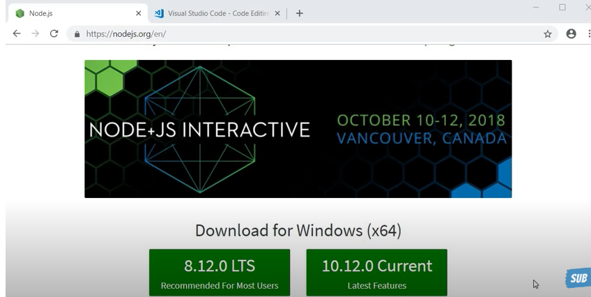
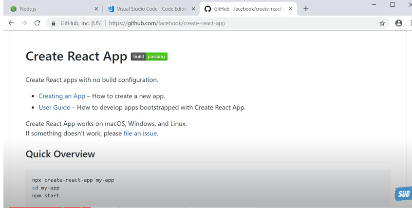
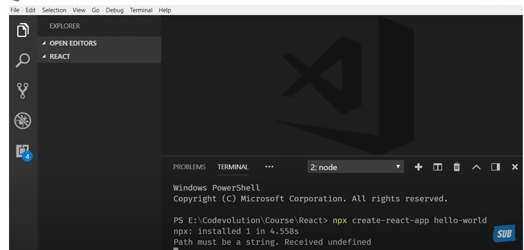
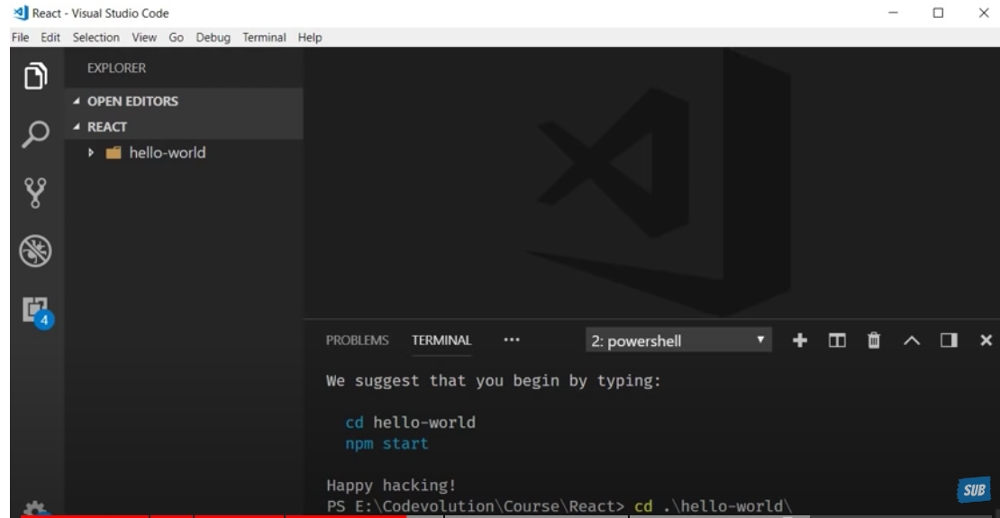
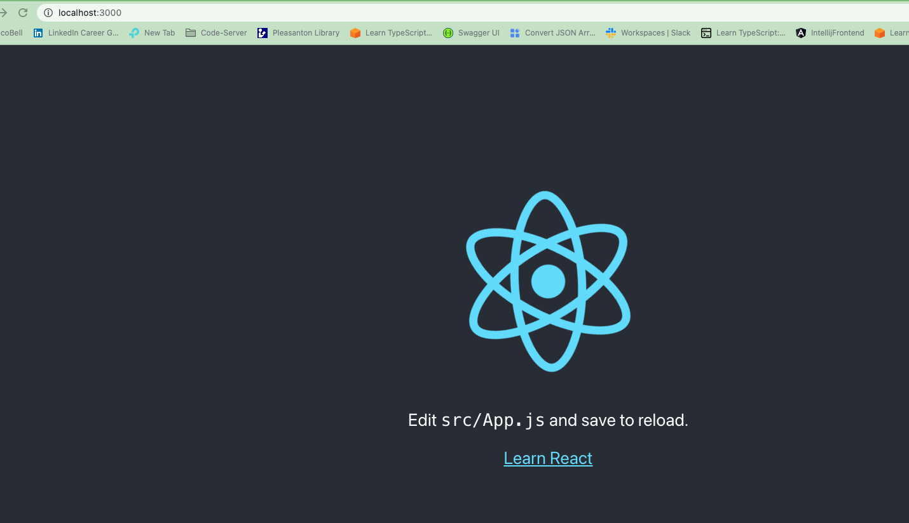
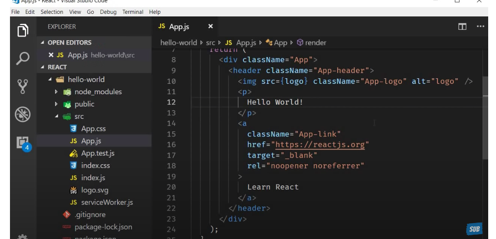
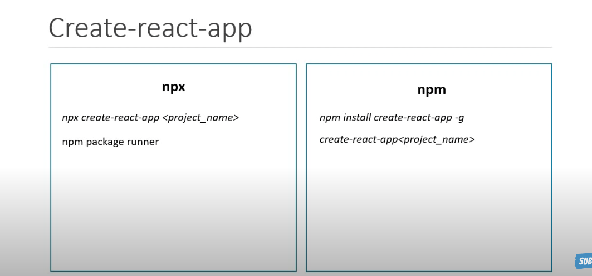

For Text Editor -Install VSCode

Create React App is a comfortable environment for learning React, and is the best way to start building a new single-page application in React.

It sets up your development environment so that you can use the latest JavaScript features, provides a nice developer experience, and optimizes your app for production.

npx create-react-app <<application name>>

npx create-react-app hello-world

we have created a folder React. And we will be using the folder for build the app

Then issue the below command
npm start( with in React/hello-world) folder

edit the file hello-world/src/App.js and update the file with Hello World !

