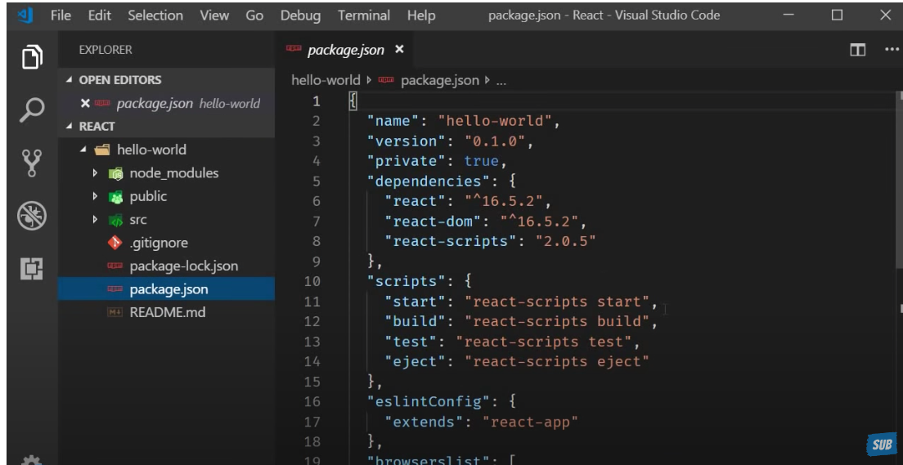

* 3 Folders
    * node_modules
    * public
    * src
* 4 Files
    .gitignore
    package-lock.json
    package.json
    Readme.md

    Let us start with package.json
    

    * this file contains the dependencies and scripts required for the project
    * dependencies will show the version of reactjs - as per sceenshot - it is using 16.5.2 as reactjs version.

    * Script Section
     it has scripts to start, build, test, eject the application

     Package-lock.json

     It will contain package-lock or yarm lock based on the package manager one is using ...

Next Folders

node_modules - will contain all the dependencies 
index.html is the only file one will have in reactjs
we are building single page applications
react will control the UI using one div tag in the body.. 
Hence index.html file is not changed.
src folder is the folder which will working most of the time for the development

The staring point for the application is index.js.

Index.js specifies the Root Component which is <App>

And the Dom Compoment which is controlled by React
Dom component is element of id as root.

<App> component is the which represents view in the browser

App.css - contains Styles
App.test.js contains the unit testcases

index.css will apply styles to the body tag

